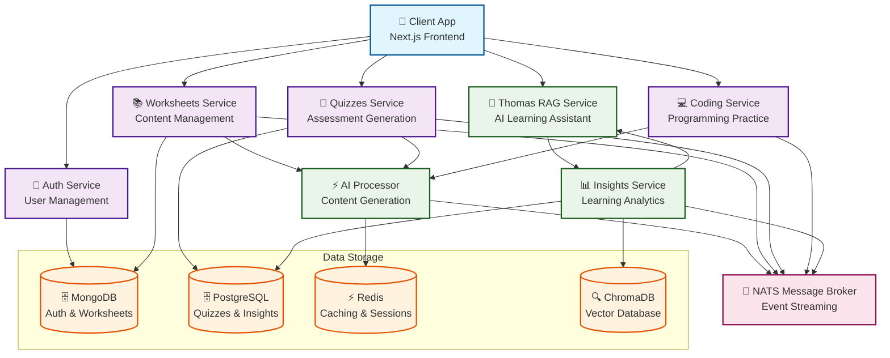
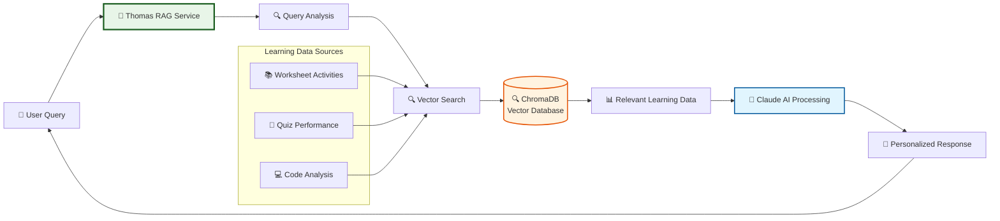

# 🎓 Worksheeter

> **AI-Powered Educational Platform**  
> Generate intelligent worksheets and quizzes with advanced microservices architecture

[](LICENSE)
[](https://nodejs.org/)
[](https://www.typescriptlang.org/)
[](https://kubernetes.io/)

---

## ✨ Overview

Worksheeter is a modern, microservices-based educational platform that leverages AI to automatically generate personalized worksheets and quizzes. Built with scalability and performance in mind, it provides educators and students with intelligent learning materials.

### 🚀 Key Features

- **🤖 AI-Powered Generation** - Intelligent content creation using Claude API
- **🧠 Thomas RAG Assistant** - Personalized AI learning companion with vector search
- **📚 Dynamic Worksheets** - Customizable educational materials
- **🧠 Smart Quizzes** - Adaptive assessment generation
- **💻 Coding Practice** - Programming challenges with AI-powered feedback
- **📊 Learning Analytics** - Comprehensive progress tracking and insights
- **🔐 Secure Authentication** - Robust user management
- **⚡ Real-time Processing** - Event-driven architecture
- **📱 Modern UI/UX** - Responsive Next.js frontend
- **🐳 Cloud-Native** - Kubernetes-ready deployment

---

## 🏗️ Architecture

### Microservices Ecosystem



### Service Breakdown

| Service | Technology | Purpose |
|---------|------------|---------|
| **Auth** | Node.js + TypeScript | User authentication & authorization |
| **Worksheets** | Node.js + TypeScript | Worksheet CRUD & management |
| **Quizzes** | Node.js + TypeScript | Quiz generation & assessment |
| **Coding** | Node.js + TypeScript | Programming practice problems |
| **AI Processor** | Node.js + TypeScript | AI-powered content generation |
| **Insights** | Node.js + TypeScript | Learning analytics & data processing |
| **Thomas** | Node.js + TypeScript | RAG-powered AI learning assistant |
| **Client** | Next.js + React | Modern web interface |

---

## 🤖 Thomas: AI Learning Assistant

### RAG-Powered Intelligence

Thomas is our advanced AI learning assistant that provides personalized educational guidance through sophisticated Retrieval-Augmented Generation (RAG) technology.

#### How Thomas Works



#### Key Capabilities

- **🎯 Personalized Insights** - Analyzes your learning patterns and progress
- **📊 Performance Analytics** - Tracks quiz scores, coding challenges, and worksheet completion
- **🧠 Cognitive Pattern Recognition** - Identifies your learning strengths and areas for improvement
- **📈 Adaptive Recommendations** - Suggests targeted practice and study strategies
- **💬 Natural Conversations** - Chat naturally about your educational journey

#### Data Processing Pipeline

1. **Event Collection** - Learning activities are captured and stored as vector embeddings
2. **Semantic Search** - Thomas searches through your learning history using vector similarity
3. **Context Analysis** - Relevant learning data is retrieved and analyzed
4. **AI Generation** - Claude AI generates personalized responses based on your data
5. **Confidence Scoring** - Response quality is assessed before delivery

---

## 🛠️ Technology Stack

### Backend
- **Runtime**: Node.js 18+
- **Language**: TypeScript
- **Framework**: Express.js
- **Message Broker**: NATS
- **AI Integration**: Claude API

### Frontend
- **Framework**: Next.js 13+
- **UI Library**: React 18+
- **Styling**: CSS-in-JS + Tailwind
- **State Management**: React Hooks

### Data & Infrastructure
- **Databases**: MongoDB, PostgreSQL
- **Cache**: Redis
- **Containerization**: Docker
- **Orchestration**: Kubernetes
- **Development**: Skaffold

---

## 🚀 Quick Start

### Prerequisites

- **Node.js** 18.0.0 or higher
- **Docker** Desktop or Docker Engine
- **Kubernetes** cluster (Minikube, Docker Desktop, or cloud)
- **Skaffold** CLI

### Installation

1. **Clone the repository**
   ```bash
   git clone https://github.com/your-username/worksheeter.git
   cd worksheeter
   ```

2. **Install dependencies**
   ```bash
   # Install all service dependencies
   npm run install:all
   
   # Or install individually
   cd auth && npm install && cd ..
   cd worksheets && npm install && cd ..
   cd quizzes && npm install && cd ..
   cd ai-processor && npm install && cd ..
   cd client && npm install && cd ..
   ```

3. **Environment setup**
   ```bash
   # Copy environment templates
   cp auth/.env.example auth/.env
   cp worksheets/.env.example worksheets/.env
   cp quizzes/.env.example quizzes/.env
   cp ai-processor/.env.example ai-processor/.env
   cp client/.env.example client/.env
   
   # Configure your environment variables
   # (API keys, database URLs, etc.)
   ```

4. **Start development environment**
   ```bash
   # Full-stack development with Kubernetes
   skaffold dev
   
   # Or run services individually
   npm run dev:all
   ```

---

## 📁 Project Structure

```
worksheeter/
├── 📦 auth/                    # Authentication service
│   ├── src/
│   │   ├── routes/            # API endpoints
│   │   ├── models/            # User models
│   │   └── lib/               # Utilities
│   └── Dockerfile
├── 📚 worksheets/              # Worksheet management
│   ├── src/
│   │   ├── routes/            # CRUD operations
│   │   ├── models/            # Worksheet models
│   │   └── events/            # Event publishers/listeners
│   └── Dockerfile
├── 🧠 quizzes/                 # Quiz generation service
│   ├── src/
│   │   ├── routes/            # Quiz endpoints
│   │   ├── services/          # Business logic
│   │   └── events/            # Event handling
│   └── Dockerfile
├── 🤖 ai-processor/            # AI content generation
│   ├── src/
│   │   ├── services/          # AI integration
│   │   ├── events/            # Event processing
│   │   └── types/             # Type definitions
│   └── Dockerfile
├── 💻 coding/                  # Programming practice
│   ├── src/
│   │   ├── routes/            # Code execution
│   │   ├── lib/               # Problem definitions
│   │   └── events/            # Code analysis events
│   └── Dockerfile
├── 📊 insights/                # Learning analytics & RAG
│   ├── src/
│   │   ├── services/          # Analytics & vector services
│   │   ├── routes/            # Thomas chat endpoints
│   │   ├── events/            # Learning event listeners
│   │   └── lib/               # Database & AI clients
│   └── Dockerfile
├── 🎨 client/                  # Next.js frontend
│   ├── pages/                 # Application routes
│   ├── components/            # React components
│   ├── hooks/                 # Custom hooks
│   └── styles/                # Styling
├── 🏗️ infra/                   # Infrastructure
│   ├── auth/                  # Auth service K8s configs
│   ├── worksheets/            # Worksheets K8s configs
│   ├── quizzes/               # Quizzes K8s configs
│   ├── shared/                # Shared K8s resources
│   └── k8s/                   # Kubernetes manifests
└── 📄 skaffold.yaml           # Skaffold configuration
```

---

## 🔄 Service Communication

### Synchronous Communication
- **HTTP REST APIs** for direct service-to-service calls
- **Standardized response formats** across all services

### Asynchronous Communication
- **NATS Message Broker** for event-driven architecture
- **Event-driven workflows** for AI processing and content generation
- **Reliable message delivery** with retry mechanisms

### Event Flow
```
User Action → Service → Event Published → AI Processor → Content Generated → Event Published → Service Updated
```

---

## 🧪 Development

### Local Development
```bash
# Run individual services
npm run dev:auth
npm run dev:worksheets
npm run dev:quizzes
npm run dev:ai-processor
npm run dev:client

# Run all services
npm run dev:all
```

### Kubernetes Development
```bash
# Start full development environment
skaffold dev

# Deploy to production
skaffold run
```

### Testing
```bash
# Run tests for all services
npm run test:all

# Run tests for specific service
npm run test:auth
npm run test:worksheets
```

---

## 📊 Monitoring & Observability

- **Health Checks** - Built-in health endpoints for all services
- **Logging** - Structured logging with correlation IDs
- **Metrics** - Performance monitoring and alerting
- **Tracing** - Distributed tracing for request flows

---

## 🤝 Contributing

We welcome contributions! Please see our [Contributing Guidelines](CONTRIBUTING.md) for details.

### Development Workflow

1. **Fork** the repository
2. **Create** a feature branch (`git checkout -b feature/amazing-feature`)
3. **Commit** your changes (`git commit -m 'Add amazing feature'`)
4. **Push** to the branch (`git push origin feature/amazing-feature`)
5. **Open** a Pull Request

### Code Standards

- **TypeScript** for type safety
- **ESLint** for code quality
- **Prettier** for code formatting
- **Conventional Commits** for commit messages

---

## 📄 License

This project is licensed under the MIT License - see the [LICENSE](LICENSE) file for details.

---

## 🙏 Acknowledgments

- **Claude API** for AI-powered content generation
- **NATS** for reliable message brokering
- **Kubernetes** for container orchestration
- **Next.js** for the modern React framework

